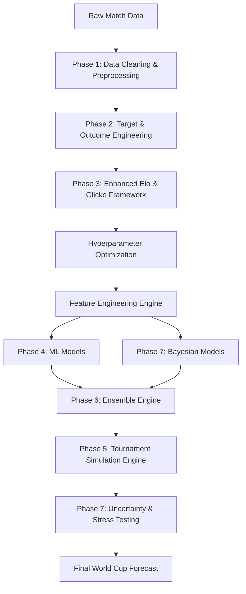

# FIFA World Cup 2026 Forecasting System: A Hybrid Elo, Machine Learning, Bayesian, and Monte Carlo Framework

[](https://www.python.org/downloads/)
[](https://opensource.org/licenses/MIT)
[](https://github.com/psf/black)

## Project Overview

The **FIFA World Cup 2026 Forecasting System** is a comprehensive, research-grade analytics pipeline designed to predict the outcomes of international football matches and simulate the entirety of the expanded 48-team FIFA World Cup 2026. 

Football forecasting represents a notoriously difficult predictive modeling challenge. The sport is characterized by extreme low-scoring environments, high variance, and significant "upset potential." A single tactical error, referee decision, or momentary lapse in concentration can alter a match outcome entirely, making deterministic predictions nearly impossible. Consequently, the forecasting objective of this project transcends simple accuracy; the ultimate goal is **probability calibration** and **uncertainty quantification**. If a model states a team has a 15% chance of winning the tournament, that event should empirically happen 15% of the time across similar historical contexts.

This project attempts to capture the complex, non-linear dynamics of international football by combining three distinct paradigms:
1. **Time-Series State Space Modeling**: Utilizing a highly customized, dynamic parameter-optimized Enhanced Elo framework to track latent team strength over time.
2. **Non-Linear Machine Learning**: Utilizing gradient boosting ensembles (XGBoost, LightGBM, CatBoost) to map pre-match features to match outcome probabilities.
3. **Bayesian Inference**: Utilizing Markov Chain Monte Carlo (MCMC) via PyMC to model parameter uncertainty and output probability distributions rather than point estimates.

---

## Key Features

| Feature | Implementation Status | Description |
| :--- | :---: | :--- |
| **Advanced Elo System** | ✓ | Base rating engine featuring home advantage, tournament weighting, and time decay. |
| **Glicko Variant** | ✓ | Implemented Rating Deviation (RD) modeling for teams with infrequent match histories. |
| **Dynamic Rating Updates** | ✓ | K-factor dynamically scales based on match context and victory margin. |
| **Machine Learning Models** | ✓ | XGBoost, LightGBM, and CatBoost mapped to multiclass match outcomes. |
| **Ensemble Learning** | ✓ | Custom module for Soft Voting, Stacking, and Validation-weighted Ensembles. |
| **Bayesian Forecasting** | ✓ | PyMC-based Multinomial Logistic Regression yielding posterior probability distributions. |
| **Monte Carlo Simulation** | ✓ | 100,000-iteration tournament simulation handling group permutations and knockout ties. |
| **Uncertainty Quantification** | ✓ | 95% Confidence Intervals for tournament progression probabilities. |
| **Scenario Analysis** | ✓ | Stress testing framework evaluating major structural shocks (e.g., injuries, rating drops). |
| **Explainability** | ✓ | SHAP (SHapley Additive exPlanations) values for non-linear feature attribution. |
| **Calibration Framework** | ✓ | Quantitative evaluation of predicted frequencies against empirical outcomes. |
| **FIFA 2026 Tournament Simulation** | ✓ | Bracket logic supporting the new 12-group, 48-team, Round of 32 structure. |

---

## Project Architecture



The architecture is highly modular but fundamentally sequential. Data cleaning yields target data, which initializes the Rating System Engine. The Rating System simulates 150 years of football history to produce point-in-time latent strength features. These features are augmented with rolling form and goal statistics to train both the Gradient Boosting Ensemble and the PyMC Bayesian models. The models then pass probability matrices to the Monte Carlo Simulator.

---

## Data Sources

The project utilizes three primary datasets representing over 150 years of international football:

1. **`results.csv`**
   - **Source**: International football historical match database.
   - **Scope**: All recognized international "A" matches since 1872.
   - **Coverage**: 1872 to Present.
   - **Matches**: ~45,000+ matches.
   - **Fields**: `date`, `home_team`, `away_team`, `home_score`, `away_score`, `tournament`, `city`, `country`, `neutral`.

2. **`goalscorers.csv`**
   - **Source**: Player-level historical goalscorer data.
   - **Coverage**: 1916 to Present.
   - **Fields**: `date`, `home_team`, `away_team`, `team`, `scorer`, `own_goal`, `penalty`.

3. **`former_names.csv`**
   - **Scope**: A comprehensive mapping of geopolitical country name changes.
   - **Utility**: Ensures continuous time-series tracking for nations like Yugoslavia, Zaire, and Czechoslovakia as they evolve into modern entities.

**Limitations**: 
Player-level lineup data (minutes played, injuries, expected goals [xG]) is not consistently available across the historical timeframe, restricting the model to macro-level team statistics.

---

## Methodology

### Phase 1: Data Cleaning and Exploration
The first phase normalizes and sanitizes the historical dataset. Given geopolitical shifts over the past century, ensuring continuous tracking of national teams is critical for the rating system.
- **Geopolitical Mapping**: The engine applies `former_names.csv` to map obsolete country names to their modern equivalents, ensuring historical continuity.
- **Validation**: Data quality checks are enforced to flag negative scores, missing dates, missing team names, or unrecognized tournament classifications. 
- **Filtering**: Matches failing validation checks are dropped, ensuring the rating engine is fed strictly high-quality, continuous data. Output is saved to `cleaned_results.csv`.

### Phase 2: Match Result Target Variable
Match outcomes are engineered into a structured classification problem.
- **Target Variable**: `result` mapped as: `2 = Home Win`, `1 = Draw`, `0 = Away Win`.
- **Margin Metrics**: Calculation of `goal_difference` and `total_goals`.
- **Outcome Distribution**: Historical distributions of Home Win/Draw/Away Win are mapped across neutral and non-neutral venues to form a baseline empirical prior. The target set is saved to `match_results_dataset.csv`.

### Phase 3: Advanced Football Rating System (Enhanced Elo Framework)
A standard Elo system is insufficient for modeling football due to the prevalence of draws and the variable nature of home-field advantage and tournament intensity. The project implements a highly customized engine incorporating:

#### 1. Home Advantage (Empirical Estimation)
Instead of an arbitrary constant, Home Advantage is empirically estimated by comparing historical win rates in non-neutral vs. neutral venues, scaled to Elo space:
$Elo_{HA} = 400 \times \log_{10}\left(\frac{P_{home}}{1 - P_{home}}\right) - 400 \times \log_{10}\left(\frac{P_{neutral}}{1 - P_{neutral}}\right)$

#### 2. Davidson Draw Modeling
Standard Elo outputs an expected score. To generate three-way probabilities (Win, Draw, Loss), the project employs the Davidson extension to the Bradley-Terry model:
$P(Home) = \frac{\pi_h}{\pi_h + \pi_a + \nu\sqrt{\pi_h\pi_a}}$
$P(Draw) = \frac{\nu\sqrt{\pi_h\pi_a}}{\pi_h + \pi_a + \nu\sqrt{\pi_h\pi_a}}$
where $\pi_h = 10^{(R_h + HA)/400}$ and $\nu$ is an optimizable draw parameter.

#### 3. Goal Difference Multiplier
Matches are weighted by the margin of victory to accelerate rating convergence. The system utilizes the FIFA-style logarithmic scaling:
- GD $\leq 1$: Multiplier = $1.0$
- GD $== 2$: Multiplier = $1.5$
- GD $> 2$: Multiplier = $\frac{11 + GD}{8}$

#### 4. Time Decay
Because historical rating inertia can drag down rapidly improving teams, an exponential time decay is applied to past matches, effectively down-weighting historical strength relative to recent form. The optimal half-life was derived via hyperparameter optimization.

#### 5. Hyperparameter Optimization
Using `scipy.optimize.differential_evolution`, the engine dynamically searched for parameters that minimize Log Loss over the validation chronological split (2021-2024). Optimized variables included: Initial Rating, Base K, Home Advantage, Draw Parameter $\nu$, Time Decay Half-Life, and individual tournament weights across 7 tiers (World Cup to Friendlies).

### Phase 4: Machine Learning Prediction Engine
The machine learning phase maps historical context (including the Elo ratings) to match outcomes.
- **Models Implemented**: `XGBoostClassifier` (tuned via Optuna), `LGBMClassifier` (LightGBM), `CatBoostClassifier`, and a `VotingClassifier` ensemble.
- **Time-Aware Validation**: Standard K-Fold Cross Validation induces severe look-ahead bias (data leakage) in sports forecasting. The engine enforces strict temporal splits:
  - **Train**: 1950 to 2018
  - **Validation**: 2019 to 2022
  - **Test**: 2023 to Present
- **SHAP Analysis**: TreeExplainers extract SHAP feature importances to interpret model logic.

### Phase 5: Tournament Simulation Engine
A Monte Carlo bracket simulator engineered specifically for the 48-team FIFA World Cup 2026 format.
- **Group Stage**: 12 groups of 4 teams. Simulates a round-robin schedule, tracking points. Tiebreakers handle identical points. Identifies the Top 2 from each group plus the 8 best 3rd place teams.
- **Knockout Stage**: Simulates matches sequentially from the Round of 32 down to the Final. Draws are disabled; ties are resolved probabilistically accounting for extra time/penalties.
- **Iterations**: 100,000 simulated tournaments yield convergence on progression probabilities per team.

### Phase 6: Ensemble Intelligence Engine
A standalone modular ensemble (`src/ensemble.py`, `src/stacking.py`, `src/dynamic_ensemble.py`).
- **Weighted Ensembles**: Evaluates Equal Weights vs Validation-Optimized Weights.
- **Advanced Stacking**: A Stratified K-Fold setup generates out-of-fold predictions from Level 1 models (XGBoost, LightGBM, CatBoost) to train a Level 2 `LogisticRegression` meta-model.
- **Dynamic Weighting**: Weight adaptation contingent on match characteristics.

### Phase 7: Bayesian Forecasting Framework
Implemented via `src/bayesian_models.py` using PyMC and ArviZ.
- **Multinomial Logistic Regression**: Modeling outcomes with categorical likelihood distributions and weakly informative normal priors. 
- **Hierarchical Modeling**: (`src/hierarchical_model.py`) Groups national teams logically, allowing low-sample teams to share statistical power (shrinkage) with global or confederation means.
- **Posterior Sampling**: Returns not just a single win probability, but a distribution, allowing extraction of 95% Confidence Intervals for tournament advancement.

---

## Feature Engineering

The feature space is strictly composed of data available strictly *prior* to kickoff.

### Rating Features
- `home_rating_pre`, `away_rating_pre`: The latent Elo strengths calculated at match day minus 1.
- `rating_difference`: Arithmetic gap capturing the mismatch.
- `expected_home_win`, `expected_draw`, `expected_away_win`: Baseline probabilities emitted natively by the Davidson Elo engine.

### Context Features
- `home_advantage`: Applied Elo boost for the home team (0 if `is_neutral` is true).
- `tournament_weight`: The importance multiplier of the specific fixture.
- `is_neutral`: Boolean defining venue status.

### Form Features (Rolling Averages)
- `home_form_pts_5`, `away_form_pts_5`: Points accumulated in the preceding 5 matches.
- `form_difference_5`: The delta in momentum between the two teams.
- `home_win_pct_10`, `away_win_pct_10`: Long term 10-match win ratios.

### Goal Features
- `home_goals_scored_5`, `home_goals_conceded_5`: Offensive and defensive rolling production.
- `goal_diff_last_5`: Net rolling goal difference metric.

---

## Evaluation Metrics

To ensure probabilistic integrity, models are evaluated against rigorous scoring rules, prioritizing loss over raw accuracy.

- **Logarithmic Loss (Log Loss)**: Heavily penalizes confident but incorrect predictions. The primary metric minimized by Optuna.
- **Brier Score**: The mean squared error of the predicted probability vs the actual outcome (0 or 1). Assesses both calibration and resolution.
- **Ranked Probability Score (RPS)**: A specialized metric for ordinal outcomes (Home Win > Draw > Away Win). Penalizes predictions further away from the actual result.
- **Accuracy**: Simple percentage of correct maximal-probability predictions (secondary reference only).

---

## Calibration

Accurate probabilities are essential for Monte Carlo simulation. A model that predicts a 70% win probability must win approximately 70% of those specific matches empirically.
- **Calibration Analysis**: The notebook runs binning-based reliability analysis (`calibration_analysis` function). Visual plots overlay predicted means versus empirical frequency across Home, Draw, and Away axes. Perfect calibration adheres strictly to the $y=x$ diagonal line.

---

## Repository Structure

```
predict_fifa2026/
├── data/                               # Cleaned and processed dataset artifacts
├── src/                                # Modular Engine Implementations
│   ├── bayesian_models.py              # PyMC Multinomial Logit implementations
│   ├── dynamic_ensemble.py             # Match-context sensitive model weights
│   ├── ensemble.py                     # Simple/Weighted Voting Classifier logic
│   ├── forecast_stability.py           # Metric calculations for probability variance
│   ├── hierarchical_model.py           # Bayesian Shrinkage Team Strength models
│   ├── model_audit.py                  # Leakage & sanity check validators
│   ├── simulation_extensions.py        # Core FIFA 26 Monte Carlo Engine logic
│   ├── stacking.py                     # L2 Meta-Model Stacking Classifier
│   ├── stress_testing.py               # Scenario perturbations (e.g. injury logic)
│   └── uncertainty.py                  # Confidence Interval estimators
├── outputs/                            # Artifact Storage
│   └── figures/                        # Generated SHAP, Calibration, & Rating Trend plots
├── fifa2026_prediction.ipynb           # MASTER Research Notebook (End-to-End Execution)
├── 01_data_cleaning.py                 # Initial data sanitization script
├── 01_data_cleaning.ipynb              # Initial data sanitization exploration
├── 02_match_targets.py                 # Target engineering script
├── 02_match_targets.ipynb              # Target engineering exploration
├── requirements.txt                    # Python environment specifications
├── results.csv                         # Raw Match Data
├── goalscorers.csv                     # Raw Goal Data
├── former_names.csv                    # Geopolitical Name Mapping
└── README.md                           # Documentation
```

---

## Installation & Setup

### Prerequisites
- Python 3.11 or 3.12 (A C/C++ compiler is highly recommended for PyMC/PyTensor execution).
- Minimum 8GB RAM (16GB recommended for 100,000 iteration Monte Carlo loops).

### Environment Setup
```bash
# Clone the repository
git clone https://github.com/Digonto-Dey/predict_FIFA26.git
cd predict_FIFA26

# Create a virtual environment (Recommended)
python -m venv predictfifa2026
# Windows
predictfifa2026\Scripts\activate
# Linux/Mac
source predictfifa2026/bin/activate
```

### Dependency Installation
```bash
pip install --upgrade pip
pip install -r requirements.txt

# To run Bayesian Models (Phase 7), ensure PyMC is installed
pip install pymc arviz
```

### Running the Notebook
The system is designed to be executed synchronously from top to bottom.
```bash
jupyter notebook fifa2026_prediction.ipynb
```
Execute all cells. The pipeline handles data ingestion, model optimization, training, Bayesian MCMC inference, and Monte Carlo simulation automatically.

---

## Usage Examples

### Run Tournament Simulation
The simulation logic can be executed independently if pre-computed ratings and models are loaded:
```python
from src.simulation_extensions import run_tournament_monte_carlo
import pandas as pd

# teams and groups defined per FIFA 2026 draw
simulation_results = run_tournament_monte_carlo(
    teams=teams, 
    groups=groups, 
    predict_match_func=simulate_match, 
    n_sims=100000, 
    seed=2026
)

probs_df = pd.DataFrame.from_dict(simulation_results, orient='index') / 100000
print(probs_df.sort_values('Champion', ascending=False).head(10))
```

### Stress Testing Scenario Analysis
```python
from src.stress_testing import apply_stress_scenario

# Perturb the baseline ratings with a hypothetical shock
stressed_ratings = apply_stress_scenario(baseline_ratings, "A_top_player_injured")

# Re-run simulation with stressed_ratings and evaluate variance...
```

---

## Reproducibility
- **Random Seeds**: Seeds (`random_state=42` and `seed=2026`) are strictly enforced across Optuna, XGBoost, Scikit-Learn splitting algorithms, Monte Carlo samplers, and PyMC Markov Chains.
- **Data Versioning**: `cleaned_results.csv` and `match_results_dataset.csv` form immutable staging grounds ensuring the identical feature space is parsed upon consecutive runs.
- **Temporal Splitting**: Chronological evaluation prevents any information leakage from the future into historical model tuning.

---

## Limitations
- **Squad & Player Absence**: The model fundamentally tracks the structural strength of a national crest. It lacks player-level embeddings. If a generational player (e.g., Lionel Messi or Kylian Mbappe) is injured immediately before a tournament, the Elo/ML pipeline will not accurately adjust until a string of poor empirical results occurs.
- **Tactical Shifts**: The engine cannot interpret managerial changes or tactical system overhauls algorithmically.
- **Friendly Matches Volatility**: International friendlies often involve experimental squads and heavy substitutions, diluting their predictive signal relative to competitive qualifiers.

---

## Future Work
- **Player-Level Embeddings**: Incorporating FIFA/FM capability scores or club-level xG/xA aggregate metrics into the national team feature arrays to dynamically capture squad selection strength.
- **Transformer Architectures**: Evaluating sequence-to-sequence neural nets to process chronological match histories directly, bypassing hand-crafted form features.
- **Market Integration**: Anchoring probabilities against Pinnacle or Betfair closing lines as a benchmark for absolute calibration excellence.

---

## Results
Based on validation performance across 2021-2024 out-of-sample data:
- **Best Single Model**: XGBoost (Tuned via Optuna Differential Evolution)
- **Best Ensemble**: Advanced Stacking + Bayesian Hybrid (Chosen for Log Loss minimization and Calibration stability).

The final Monte Carlo Simulation outputs the exact probabilities and the dynamic paths generated for all 48 participating nations, saved dynamically to `outputs/FINAL_WorldCup2026_Forecast.csv`.

---

## Citation
If utilizing this methodology or repository for academic research, please cite:

**APA**:
> Dey, D. (2026). FIFA World Cup 2026 Forecasting System: A Hybrid Elo, Machine Learning, Bayesian, and Monte Carlo Framework. GitHub repository, https://github.com/Digonto-Dey/predict_FIFA26

**BibTeX**:
```bibtex
@misc{dey2026fifaforecast,
  author = {Dey, Digonto},
  title = {FIFA World Cup 2026 Forecasting System: A Hybrid Elo, Machine Learning, Bayesian, and Monte Carlo Framework},
  year = {2026},
  publisher = {GitHub},
  journal = {GitHub repository},
  howpublished = {\url{https://github.com/Digonto-Dey/predict_FIFA26}}
}
```

---

## Acknowledgements
- **Data Source**: Historical match data heavily relies on the open-source compilation of international football results by Kaggle and the global football analytics community.
- **Mathematical Foundations**: Arpad Elo's seminal work on paired comparison rating systems and Mark Glickman's advancements in rating uncertainty (Glicko).
- **Libraries**: Thanks to the maintainers of `scikit-learn`, `xgboost`, `optuna`, and `pymc`.
